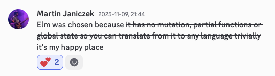

---
presentation:
  enableSpeakerNotes: true
  controls: true
  progress: true
  width: 1400
  height: 1000
  theme: beige.css
---

<!-- slide -->

### A Gateway Drug to 💊

<strike>Functional Programming</strike>

<strike>Static Typing</strike>

#### Developer Happiness 🤗

Why Elm, Gleam, (or F#) might be your next favorite language.

<!-- slide -->

### About Me 🧔‍♂️

For five years I worked fullstack in Elm and F#, with some TypeScript sprinkled in.

[@stoft](https://github.com/stoft)

<!-- slide -->

### What This Presentation Is Not About 🤔

The advantages of functional programming such as:

- Immutability by default
- Function composition (|>)
- Pure functions
- etc.

They're all there, but there are tons of resources out there about them.

<!-- slide -->

### Enter the Next Level 🛗

> “No runtime exceptions.”

> "Safe refactoring."

> "Just follow the compiler"

<!-- slide -->

#### Core Properties That Change Everything 💡

Beyond classic FP advantages...

- Developer-Friendly Compilers
- Small Languages
- Pattern matching
- Type-Driven Development
- Parse, Don't Validate
- Make Impossible States Impossible
- TEA / MVU Architecture

<!-- slide -->

### Developer-Friendly Compilers ❤️

Typescript

<code class="language-text">
Property 'documentTyp' does not exist on type '{ id: string; name: string; documentType: string; appliesTo: number; s3Key?: string | undefined; query: { project?: string | undefined; unitType?: string | undefined; unitModel?: string | undefined; serialNumber?: string | undefined; }; }'. Did you mean 'documentType'?
</code>

<br/>
<!-- slide -->

#### Developer-Friendly Compilers ❤️

<br/>

<pre><code><span class="code-error">error:</span> Unknown record field

  ┌─ ./src/app.gleam:8:16
  │
8 │ user.alias
  │ <span style="color: red;">    ^^^^^^ Did you mean `name`?</span>

The value being accessed has this type:
    User

It has these fields:
    .name
</code></pre>

<br/>

Guess who else loves them? LLMs.

<!-- slide -->

#### Small Languages

- Languages you can keep in your head. 🧠
- Usually just one way to do something.
- Elm has consistently removed syntax.
- Gleam, inspired by Elm is small from the start (no `if`, just `case`).
- F# is also small, but has support for OO which adds quite a bit.

<!-- slide -->

#### Pattern Matching 🔍

Multi-argument patterns

```elm
let result = case x, y {
    0, 0 -> "Both are zero"
    0, _ -> "First is zero"
    _, 0 -> "Second is zero"
    _, _ -> "Neither are zero"
  }
```

This is steroids for implementing complex logic.

<!-- slide -->

### Pattern Matching 🔍

Exhaustive Checks

```elm
let result = case x, y {
    0, 0 -> "Both are zero"
    0, _ -> "First is zero"
    _, 0 -> "Second is zero"
  }
```

<br/>

<pre><code>
<span>error:</span> Inexhaustive patterns
   ┌─ /src/main.gleam:9:16
   │  
 9 │     let result = case x, y {
   │ ╭────────────────^
10 │ │     0, 0 -> "Both are zero"
11 │ │     0, _ -> "First is zero"
12 │ │     _, 0 -> "Second is zero"
13 │ │   }
   │ ╰───^

This case expression does not have a pattern for all possible values. If it
is run on one of the values without a pattern then it will crash.

The missing patterns are:

    _, _

</code></pre>

<!-- slide -->

#### Type-Driven Development (TDD++) 🧠

- Define what’s possible using types.
- Let the compiler guide implementation.
  <br />

```elm
type Result(a, e) {
  Ok(a)
  Error(e)
}

fn parse_int(x: String) -> Result(Int, String) {
	...
}
```

<br />
<br />
Specification first development inside your code, not just at the boundaries.

<!-- slide -->

#### Parse, Don’t Validate 🤔

Validation (TypeScript):
<br />

```ts
if (typeof x === "string" && x.startsWith("user:")) {
  // ...
}
```

<br />
Parsing (Gleam):

```elm
case parse_user_id(input) {
  Ok(id) -> // ...
  Error(_) -> // ...
}
```

Once parsed, everything downstream is safe by construction.

<!-- slide -->

#### Make Impossible States Impossible 🤯

TypeScript

```ts
type Payment = { method: "card" | "cash"; cardNumber?: string };
```

<br />

🚫 Can still have

```ts
{ method: 'cash', cardNumber: '1234' }
```

<br/>

<!-- slide -->

#### Make Impossible States Impossible 🤯

Gleam

```elm
// ❌
type Payment {
  Payment(method: PaymentMethod,card_number: Option(String))
}
type PaymentMethod {
  Card
  Cash
}
```

```elm
// ✅
type Payment {
  Card(card_number: String)
  Cash
}
```

<small>[ Making impossible states impossible](https://www.youtube.com/watch?v=IcgmSRJHu_8)</small>

<!-- slide -->

#### Make Impossible States Impossible 🤯

Phantom types! 👻

```elm
type User(t) { User(id: String) }
type IsAdmin
type IsReadonly

fn auth_admin(user: User(IsReadonly)) -> Result(User(IsAdmin), Nil) {
  ...
}

fn do_admin_stuff(user: User(IsAdmin)) {
...
}
```

<br />
<small>Typescript can emulate this, but you can shoot yourself in the foot with a simple <code>as</code>.</small>

<!-- slide -->

#### TEA / MVU Architecture 🫖

<small>The Elm Architecture / Model-View-Update</small>

<br />

Model <sub><small>: State</small></sub>
↓
Update <sub><small>: Effect, Model → New Model, New Side Effects</small></sub>
↓
View <sub><small>: Model → View, Hooks for Side Effects</small></sub>

<br />

<small>Guess where redux got some of its inspiration from?</small>

<!-- slide -->

#### Performance: More Than Pretty Types 🏎️


<small>Not to mention the Elm and Gleam compilers are super fast. As in 100k LOC in a few seconds fast.</small>

<!-- slide -->

#### Interoperability 🔗

- They all compile to JS!
- Gleam also compiles to Erlang.
- F# also compiles to .NET

<br />
<br />

#### What You Can Build 🏗️

- Anything JS except "native" (but Tauri/Electron).
- F#: anything .NET can do including native.
- Gleam: anything Erlang can do.

<!-- slide -->

#### The Payoff 🎁

- You will grow as a developer.
- Refactors are safe by design.
- You spend less time testing, more time thinking clearly.
- Code that represents intent, not workarounds.
- Fewer bugs, higher confidence.
- Compilers working with you.
- No nulls, no exceptions, no panics\*.
- Communities that value kindness and clarity.

<!-- slide -->

#### Developer Happiness 🤗



<!-- slide -->

#### The Real Limitations 🤔

- Elm: browser-only (more or less), smaller ecosystem.
- Gleam: young ecosystem, Erlang/BEAM learning curve.
- F#: quirky if you want OO and .NET, but a lot of power and flexibility.
- JSON de-/serialization is a pain in the 🤐.

<br />
<br />

Not dealbreakers — just tradeoffs worth knowing.

<!-- slide -->

## 🚀 The Next Level Awaits

Try one this week.
<br/>

### 🎄🎄☃️🎄🎄🎄🎄🎄☃️🎄🎄

### 🎄🎄 Advent of Code 🎄🎄

### 🎄❄️🎄🎄🎄🎅🎄🎄️🎄❄️🎄

<!-- slide -->

### Q&A - FP 🤔

- Isn’t FP too academic?
  - Not anymore. None of these languages talk about monads, functors, applicatives etc.

<!-- slide -->

### Q&A - Type Systems 🤔

- Even Java has static typing, what's the big deal?
  - The big deal is that these are "sound" type systems, they actually have your back.
- Doesn't "typing" everything make writing code slower?
  - If you want to be "fast" you can skip it, type inference is 100% and works great.
  - But typing will help clarify your thought process.

<!-- slide -->

### Q&A - Ecosystem 🤔

- What about ecosystem maturity? → Strong enough for most needs, but it can be a problem.
- LLMs are not as proficient in these languages as they are in TypeScript.
  - Giving them up to date references helps.

<!-- slide -->

### Q&A - TypeScript? 🤔

- Doesn't TS have all this already? → Yes, but it's not enforced. `ts-belt`, `zod`, etc. help a lot but they're not "batteries included" like Elm, Gleam, and F#.
